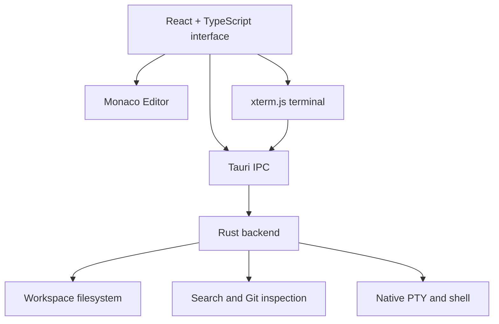

<div align="center">
  

# Veyra Editor

### Your code. Your machine. Your flow.

A local-first desktop code editor powered by **Tauri, Rust, React and Monaco**.

[](LICENSE) [](https://tauri.app/) [](https://www.rust-lang.org/) [](https://www.typescriptlang.org/)

[**Get started**](#-quick-start) · [Features](#-what-you-can-do) · [Build](#-build-a-desktop-app) · [Roadmap](#-whats-next) · [Contribute](#-contributing)

</div>

---

## Meet Veyra

**Veyra is an open-source desktop editor for developers who want to work directly with their local projects.** It brings Monaco-powered editing, project navigation, workspace search, Git inspection and an interactive shell together in one focused interface.

No cloud account or hosted workspace is required. Once built, the desktop application runs without a Vite development server or CDN.

> **Development status:** Early-stage project, tested primarily on Apple Silicon macOS. Windows and Linux are not yet verified. See [Current scope](#-current-scope) before distributing builds.

## ✨ What you can do

| Capability | Details |
| :--- | :--- |
| **Edit comfortably** | Monaco syntax highlighting, find/replace, available language completion and formatting, plus JavaScript/TypeScript diagnostics. |
| **Work across files** | Multiple tabs preserve unsaved edits; save/discard/cancel prompts protect changes. |
| **Manage projects** | Open folders, explore directories, create files and folders, rename files and move individual files to system Trash. |
| **Navigate quickly** | Quick Open, command palette, workspace text search and pattern-based symbol outline. |
| **Inspect changes** | Git branch/status information and tracked-file text diffs against HEAD. |
| **Run real commands** | Integrated xterm.js terminal connected to a native Rust PTY in your workspace. |
| **Make it yours** | Dark/light themes, font settings, word wrap, minimap, resizable sidebar and split view of the active file. |
| **Save defensively** | Atomic writes and conflict detection when another application changes a file on disk. |

**Local-first does not mean sandboxed:** terminal commands execute with your normal account permissions. Only run projects and commands you trust.

## ⚡ Quick start

### Requirements

For the tested macOS development setup, install **Node.js 22.12+**, npm, stable **Rust/Cargo**, Git and Xcode Command Line Tools. See the [Tauri prerequisites](https://v2.tauri.app/start/prerequisites/) for platform dependencies.

```bash
xcode-select --install
```

### Clone and launch

```bash
git clone https://github.com/fcopensource/veyraeditor.git
cd veyraeditor
npm ci
npm run tauri dev
```

The first native build may take a few minutes. Veyra then opens in a desktop window.

> `npm run dev` launches only the frontend. Use `npm run tauri dev` for native file dialogs, filesystem operations and terminal integration.

## 📦 Build a desktop app

On macOS, build a local application bundle:

```bash
npm run tauri build -- --bundles app
```

Find it at:

```text
src-tauri/target/release/bundle/macos/Veyra.app
```

A packaged app does not require a running development server. **This repository does not yet provide verified Windows/Linux installers, a signed public macOS release or automatic updates.** Public macOS distribution requires appropriate signing and notarization.

## 🧭 A typical workflow

1. **Open a workspace** with **Cmd+O** and select a local project directory.
2. **Find a file** in the Explorer or with **Cmd+P**; open it in a tab.
3. **Edit and save** with **Cmd+S**, or save all with **Shift+Cmd+S**. Unsaved changes remain in open tabs.
4. **Search** with **Shift+Cmd+F** across indexed files saved on disk. Search is case-insensitive literal text, capped at 500 results.
5. **Inspect Git** in Source Control; use the terminal for staging, commits, merges and pushes.
6. **Run your tools** from the terminal in the workspace folder, for example `git status` or your project's test command.

Veyra prevents an edited file from silently overwriting a version changed by another application. **Save regularly:** crash recovery and session restoration are not implemented.

## ⌨️ Shortcuts

The following shortcuts describe the tested **macOS** interface.

| Shortcut | Action |
| :--- | :--- |
| `Cmd+O` | Open workspace |
| `Cmd+N` | New file |
| `Cmd+S` / `Shift+Cmd+S` | Save file / save all |
| `Cmd+W` | Close active tab |
| `Cmd+P` | Quick Open |
| `Shift+Cmd+P` | Command palette |
| `Cmd+F` / `Option+Cmd+F` | Find / replace in editor |
| `Shift+Cmd+F` | Search workspace |
| `Shift+Option+F` | Format when supported |
| `Cmd+B` | Toggle sidebar |
| `Cmd+,` | Preferences |

## 🏗 Under the hood



**Stack:** Tauri 2 · Rust · React 19 · TypeScript · Monaco Editor · xterm.js · portable-pty · Vite 7 · Playwright.

```text
src/
  App.tsx             Workspace UI and commands
  App.css             Layout and themes
  editor.ts           Monaco configuration
  Terminal.tsx        Terminal interface
  main.tsx            React entry point
src-tauri/
  src/lib.rs          Filesystem, search, Git and PTY commands
  src/main.rs         Native entry point
  capabilities/       Tauri permissions
  icons/              Application icons
  tauri.conf.json     Desktop configuration
tests/                Browser UI tests
public/veyra.png      Project icon
```

## 🧪 Development and tests

```bash
# Type-check and build the frontend
npm run build

# Install the browser and run UI tests
npx playwright install chromium
npx playwright test

# Run native Rust unit tests
cd src-tauri
cargo test --lib
```

Playwright tests use mocked native IPC; they do **not** establish that terminal or installer integration works on every operating system. Native tests cover path validation, symlink escape protection and file-save conflicts.

## 🔒 Current scope

Veyra's editor file operations are limited to the selected workspace, with path checks and conflict-aware saving. The current implementation accepts UTF-8 text files up to **5 MB** and indexes up to **10,000 files** at a maximum depth of **25**. It skips common generated folders such as `.git`, `node_modules`, `dist`, `target` and `.venv`. The indexer does not yet honor custom `.gitignore` rules.

Language intelligence depends on bundled Monaco capabilities: Python/Rust language servers and full-project diagnostics are not implemented. Split view currently shows the **same active file** in both panes. Terminal sessions are not persistent, and unsaved buffers are not recovered after a crash.

## 🗺 What's next

These are **planned improvements, not shipped features**:

- [ ] Language Server Protocol integration and deeper language intelligence
- [ ] Integrated debugger and breakpoint management
- [ ] Git staging and commit interface
- [ ] Independently selectable split panes and multi-root workspaces
- [ ] Session restoration and crash recovery
- [ ] Persistent terminal sessions
- [ ] Extension architecture and optional AI-assisted workflows
- [ ] Tested Windows/Linux support, signed releases and automatic updates

For feature requests or bugs, [open an issue](https://github.com/fcopensource/veyraeditor/issues).

## 🤝 Contributing

Contributions are welcome. Fork the repository, create a focused branch, make your changes and open a pull request. Run `npm run build` and relevant UI/Rust tests before submitting. Include screenshots for visual changes and regression tests for filesystem-related fixes. Never commit secrets, private project files, dependencies or generated build artifacts.

## 📄 License

Released under the [MIT License](LICENSE). Copyright © 2026 Vikram Singh. Third-party dependencies retain their own licenses.

---

<div align="center">

**Your code. Your machine. Your flow.**

If you find Veyra useful, consider starring the repository ⭐

[Back to top](#veyra-editor)

</div>
