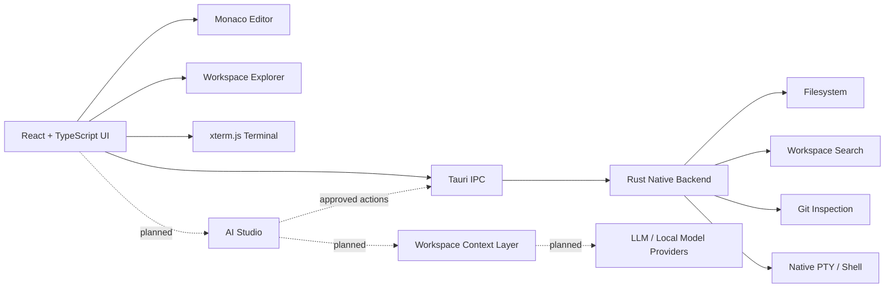

<div align="center">


# Veyra Editor

[](https://github.com/fcopensource/veyraeditor)

### A local-first desktop coding environment being built for the AI era.

**Veyra combines a native desktop shell, Monaco editing, project navigation, Git tooling and a real terminal — with an AI-native development layer on the roadmap.**

[](LICENSE)
[](https://tauri.app/)
[](https://www.rust-lang.org/)
[](https://microsoft.github.io/monaco-editor/)
[](https://react.dev/)
[](https://www.typescriptlang.org/)
[](#-ai-native-direction)

[Preview](#-interface-preview) · [Features](#-what-works-today) · [AI Vision](#-ai-native-direction) · [Quick Start](#-quick-start) · [Architecture](#-architecture) · [Roadmap](#-roadmap)

</div>

---

## ✨ Interface Preview

<p align="center">
  
</p>

<p align="center">
  <sub>Veyra desktop interface — project Explorer, editor workspace, command search and native terminal.</sub>
</p>

---

## Why Veyra?

Most developers spend hours every day inside an editor. Veyra is being designed around the idea that this environment should be **fast, local, visually calm and intelligent by default**.

The project starts with a strong desktop foundation first: real local files, native project access, a proper shell, Monaco editing and predictable developer workflows. The next layer is AI — not as a separate chatbot bolted onto the side, but as tooling that can eventually understand the workspace, propose changes, explain code, help debug and operate across files with the developer in control.

> **Current status:** Veyra is an early-stage open-source project. The editor foundation shown above is real and working. The full AI Studio/agent layer described below is a product direction and roadmap, not a claim that every AI feature already ships in the current build.

---

## 🚀 What works today

| Area | Current capability |
| --- | --- |
| **Editor** | Monaco-powered editing with syntax highlighting, find/replace, formatting support and JavaScript/TypeScript diagnostics |
| **Explorer** | Open local folders, browse nested directories, expand/collapse trees and refresh the workspace |
| **File creation** | Create files and folders inside the selected directory, including nested paths such as `components/ui/Button.tsx` |
| **Tabs** | Work across multiple files while retaining unsaved buffers |
| **Navigation** | Quick Open, command palette, workspace search and detected-symbol outline |
| **Terminal** | Real interactive shell rendered with xterm.js and backed by a native Rust PTY |
| **Git** | Repository branch/status inspection and tracked-file diffs against `HEAD` |
| **Safe writes** | Atomic saves plus protection against silently overwriting externally changed files |
| **Desktop runtime** | Native Tauri application with Rust filesystem, search, Git and PTY commands |
| **Customization** | Dark/light themes, font controls, minimap, word wrap, resizable UI and split view |

Veyra operates on your actual local project. The integrated terminal runs with your normal user permissions, so only execute code and commands you trust.

---

## 🧠 AI-native direction

The long-term goal is for Veyra to become an **AI-native code editor** where intelligence is part of the coding workflow rather than a disconnected chat window.

### AI Studio — planned

| Capability | Direction |
| --- | --- |
| **Codebase-aware chat** | Ask questions with workspace files, symbols and project structure as context |
| **Inline AI editing** | Select code, describe a change and review the generated diff before applying it |
| **Multi-file changes** | Let AI propose coordinated edits across several files with explicit approval |
| **Explain & refactor** | Explain unfamiliar code, simplify functions and suggest safer abstractions |
| **Debug assistant** | Use diagnostics, terminal output and relevant files to reason about failures |
| **Test generation** | Generate focused unit/integration tests from the code being edited |
| **AI command palette** | Invoke transformations and common engineering tasks from the keyboard |
| **Terminal intelligence** | Suggest commands and interpret errors without silently executing destructive actions |
| **Model flexibility** | Architecture for cloud or local model providers instead of tying Veyra to one vendor |
| **Developer control** | Clear context boundaries, visible diffs and explicit confirmation for file-changing actions |

The target experience is closer to:

```text
Developer intent
      ↓
Workspace context
      ↓
AI reasoning / proposal
      ↓
Visible diff or suggested action
      ↓
Developer approval
      ↓
Native Veyra file / terminal tooling
```

AI should accelerate the developer — not take control away from them.

---

## ⚡ Quick Start

### Prerequisites

For the currently tested macOS workflow:

- Node.js **22.12+**
- npm
- stable Rust + Cargo
- Git
- Xcode Command Line Tools

```bash
xcode-select --install
```

### Clone and run Veyra

```bash
git clone https://github.com/fcopensource/veyraeditor.git
cd veyraeditor

npm ci
npm run tauri dev
```

The first Rust build may take a few minutes.

> `npm run dev` starts only the Vite frontend. Use `npm run tauri dev` for the complete desktop editor with native filesystem and terminal functionality.

---

## 📦 Build the desktop application

On macOS:

```bash
npm run tauri build -- --bundles app
```

The application bundle is generated under:

```text
src-tauri/target/release/bundle/macos/
```

For a public release, macOS signing/notarization and proper Windows/Linux packaging still need to be completed.

---

## 🏗 Architecture



### Core stack

```text
Tauri 2
Rust
React 19
TypeScript
Monaco Editor
xterm.js
portable-pty
Vite 7
Playwright
```

### Repository layout

```text
veyraeditor/
├── src/
│   ├── App.tsx
│   ├── App.css
│   ├── CreateEntryDialog.tsx
│   ├── Terminal.tsx
│   ├── editor.ts
│   └── main.tsx
│
├── src-tauri/
│   ├── src/
│   ├── capabilities/
│   ├── icons/
│   └── tauri.conf.json
│
├── public/
│   ├── veyra.png
│   └── screenshots/
│       └── veyra-ai-editor-preview.jpg
│
├── tests/
├── package.json
└── vite.config.ts
```

---

## ⌨️ Keyboard workflow

| Shortcut | Action |
| --- | --- |
| `Cmd+O` | Open workspace |
| `Cmd+N` | New file |
| `Cmd+S` | Save active file |
| `Shift+Cmd+S` | Save all |
| `Cmd+W` | Close active tab |
| `Cmd+P` | Quick Open |
| `Shift+Cmd+P` | Command palette |
| `Cmd+F` | Find |
| `Option+Cmd+F` | Replace |
| `Shift+Cmd+F` | Search workspace |
| `Shift+Option+F` | Format document when supported |
| `Cmd+B` | Toggle sidebar |
| `Cmd+,` | Preferences |

These shortcuts currently reflect the macOS build.

---

## 🧪 Development & Testing

```bash
# Frontend type-check + production build
npm run build

# UI regression tests
npx playwright install chromium
npx playwright test

# Native Rust tests
cd src-tauri
cargo test --lib
```

Playwright tests exercise the UI with mocked native IPC. Rust tests cover native behavior such as workspace path validation, symlink escape protection and save-conflict handling.

---

## 🔐 Local-first philosophy

Veyra is designed around local project ownership.

Editor-side native file operations are scoped to the selected workspace. Files are written defensively, and Veyra checks for save conflicts when another process changes a file on disk.

For the future AI layer, the intended model is equally explicit: workspace context should be visible and controlled, generated changes should be reviewable, and destructive actions should never happen invisibly.

---

## 🗺 Roadmap

### Editor foundation
- [x] Monaco editor
- [x] Local workspace Explorer
- [x] Nested file/folder creation
- [x] Multi-tab editing
- [x] Workspace search
- [x] Command palette
- [x] Real integrated terminal
- [x] Git status/diff inspection

### AI-native development
- [ ] AI Studio panel
- [ ] Workspace-aware context engine
- [ ] Inline AI edit + diff review
- [ ] Multi-file AI plans
- [ ] Explain / refactor / debug actions
- [ ] Test-generation workflow
- [ ] Terminal-aware assistant
- [ ] Provider abstraction for cloud/local models

### IDE depth
- [ ] Language Server Protocol integration
- [ ] Rich Python/Rust diagnostics and completion
- [ ] Debugger + breakpoints
- [ ] Git staging / commit UI
- [ ] Independent split-editor panes
- [ ] Session restore and crash recovery
- [ ] Extension/plugin system

### Distribution
- [ ] Signed macOS releases
- [ ] Verified Windows builds
- [ ] Verified Linux builds
- [ ] Automatic updates
- [ ] Download page at **veyraeditor.com**

---

## 🤝 Contributing

Veyra is open source and contributions are welcome.

Fork the repository, create a focused branch, make your changes, run the relevant tests and open a pull request with a clear explanation. For UI changes, screenshots are strongly encouraged. For native filesystem behavior, regression coverage is especially valuable.

Please do not commit credentials, private workspace data, dependency directories or generated release artifacts.

---

## 📄 License

Veyra Editor is released under the [MIT License](LICENSE).

Copyright © 2026 Vikram Singh.

---

<div align="center">

### Veyra Editor

**Your code. Your machine. Your AI.**

Built for developers who want a focused editor today — and a genuinely AI-native development environment tomorrow.

If the project interests you, consider giving the repository a ⭐

[Back to top](#veyra-editor)

</div>
