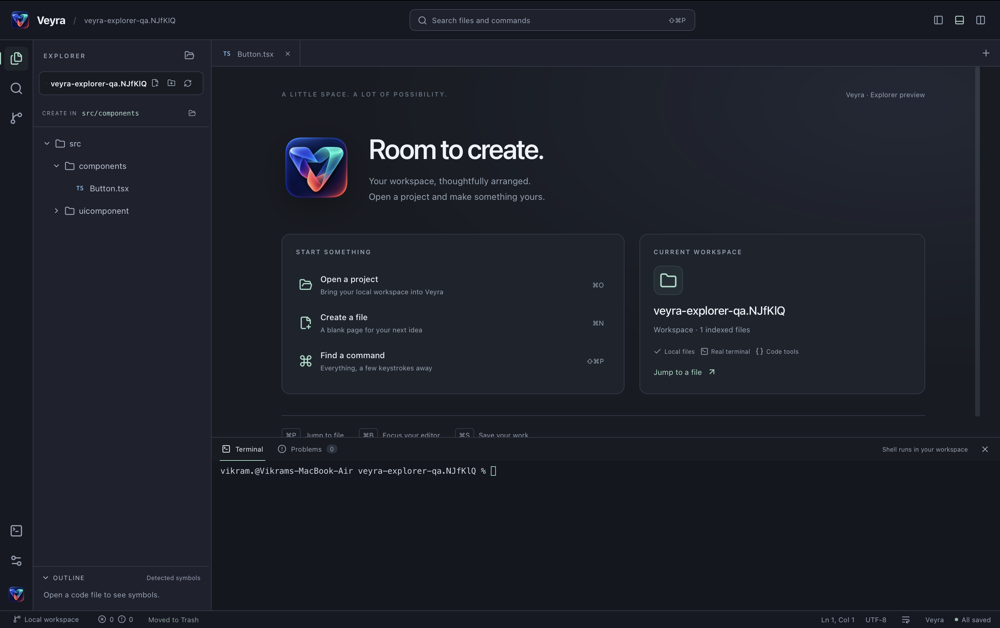
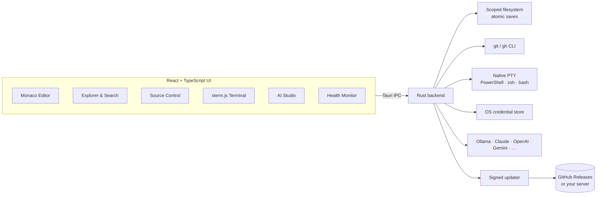

<div align="center">


# Veyra Studio

[](https://github.com/fcopensource/veyraeditor)

### A fast, local-first code editor with Git, a real terminal and AI from 11 providers built in.

[](https://github.com/fcopensource/veyraeditor/releases/latest)
[](https://github.com/fcopensource/veyraeditor/actions/workflows/release.yml)
[](https://github.com/fcopensource/veyraeditor/releases)
[](#-download)
[](LICENSE)

[](https://tauri.app/)
[](https://www.rust-lang.org/)
[](https://microsoft.github.io/monaco-editor/)
[](https://react.dev/)
[](https://www.typescriptlang.org/)

[**Download**](#-download) · [Features](#-features) · [AI Studio](#-ai-studio) · [Git](#-git-built-in) · [Build from source](#-build-from-source) · [Architecture](#-architecture) · [Roadmap](#-roadmap)

</div>

---

<p align="center">
  
</p>

## Why Veyra?

Most developers spend hours every day inside an editor. Veyra is built on the idea that this place should be **fast, local, calm and intelligent by default**:

- **Native and light.** A Rust backend and the system webview instead of a bundled browser, so installers are 7–11 MB.
- **Your files stay yours.** Veyra works directly on your local folders, saves atomically and never overwrites a file that changed on disk behind your back.
- **AI where you need it, under your control.** Pick from local models or 10 cloud providers. Every AI edit is shown as a diff and is undoable. Nothing is applied or saved without you.
- **Everything included.** Git, a real terminal, workspace search, themes and a self-diagnosing health monitor work out of the box.

---

## 📥 Download

Get the latest build from **[GitHub Releases](https://github.com/fcopensource/veyraeditor/releases/latest)**:

| Platform | Installer | Notes |
| --- | --- | --- |
| **Windows** 10 / 11 | `Veyra.Studio_x.y.z_x64-setup.exe` or `.msi` | WebView2 is installed automatically if missing |
| **macOS** · Apple silicon | `Veyra.Studio_x.y.z_aarch64.dmg` | macOS 11 or newer |
| **macOS** · Intel | `Veyra.Studio_x.y.z_x64.dmg` | macOS 11 or newer |
| **Linux** | `.AppImage` (any distro) · `.deb` (Ubuntu/Debian) · `.rpm` (Fedora) | Requires WebKitGTK 4.1 |

**Veyra updates itself.** Installed copies check for new versions on launch and every few hours, verify the download's signature, and offer a one-click **Update & restart**. You can also choose **Help → Check for Updates…**.

> [!NOTE]
> Preview builds are not yet code-signed by the OS vendors. On **Windows**, SmartScreen may show *"Windows protected your PC"*: choose **More info → Run anyway**. On **macOS**, if Gatekeeper reports the app as damaged, run `xattr -cr "/Applications/Veyra Studio.app"` once.

---

## ✨ Features

| Area | What you get |
| --- | --- |
| **Editor** | Monaco (the editor behind VS Code): syntax highlighting for 80+ languages, IntelliSense and diagnostics for JS/TS/JSON/CSS/HTML, multi-cursor, find & replace, formatting, sticky scroll, minimap |
| **Explorer** | Real local folders, nested create, rename, copy/cut/paste, duplicate, drag-and-drop, multi-select, move to Trash/Recycle Bin, reveal in Finder/File Explorer |
| **Tabs & navigation** | Multiple tabs with preserved unsaved buffers, Quick Open, command palette, workspace text search, symbol outline, Problems panel |
| **Terminal** | Real shells via a native PTY: PowerShell on Windows, your login shell on macOS/Linux. Multiple named sessions, plus "Run active file" |
| **Git** | Change markers in the gutter, file-tree badges, side-by-side diffs, branches, sync, stash, amend, history. See [Git, built in](#-git-built-in) |
| **AI Studio** | Chat, explain, and reviewed edits with 11 providers. Keys saved in your OS keychain. See [AI Studio](#-ai-studio) |
| **Health monitor** | A live 0–100 score in the status bar, plus a panel checking the backend, UI responsiveness, memory, errors, Git, shell, credential store and Ollama, with a fix hint for each problem |
| **Safe saving** | Atomic writes, detection of external changes, protection against silently overwriting files edited elsewhere, confirmation before closing unsaved work |
| **Customization** | Midnight and light themes, Open VSX themes & snippets or VSIX import, font size, word wrap, minimap, resizable panels, split view |
| **Updates** | Signed automatic updates on every platform |

---

## 🧠 AI Studio

Open it with **Ctrl/⌘ + L**, or select code and press **Ctrl/⌘ + K** to edit the selection with AI.

**Providers**

| Local | Cloud |
| --- | --- |
| **Ollama**: private, runs on your machine | **Anthropic Claude** · **OpenAI** · **Google Gemini** · **OpenRouter** · **Groq** · **Mistral** · **DeepSeek** · **xAI Grok** · **Together AI** · any **OpenAI-compatible** endpoint |

**API keys, handled like VS Code secrets**
- Paste a key once. It is encrypted in **Windows Credential Manager**, the **macOS Keychain** or your Linux **Secret Service**, and loads automatically in the background on every launch.
- Keys already set as environment variables (`ANTHROPIC_API_KEY`, `OPENAI_API_KEY`, `GEMINI_API_KEY`, `OPENROUTER_API_KEY`, `GROQ_API_KEY`, `MISTRAL_API_KEY`, `DEEPSEEK_API_KEY`, `XAI_API_KEY`, `TOGETHER_API_KEY`) are picked up with no setup.
- The **API keys** list in AI settings shows where each provider's key comes from, and lets you remove saved keys.
- Keys never touch your project files or browser storage.

**You stay in control**
- AI only sees the conversation plus what you explicitly attach: the current file, a selection, or *Smart workspace context*. Veyra picks the relevant files and shows you which ones were sent.
- Proposed edits open in a side-by-side diff. Applying updates the editor buffer only. Undo with **Ctrl/⌘ + Z**; nothing is saved until you save.
- AI never runs commands or writes files on its own.

> Cloud providers use your own account and may bill per request. For fully offline AI, install [Ollama](https://ollama.com) and run `ollama pull qwen2.5-coder:3b`.

---

## 🌿 Git, built in

- **Gutter markers:** green for added lines, blue for modified, red for deletions. They update live as you type, against `HEAD`.
- **Explorer badges:** `M` modified · `U` untracked · `A` added · `D` deleted · `R` renamed, plus a dot on folders containing changes.
- **Side-by-side diff** against `HEAD` for any changed file, with an inline toggle.
- **Stage / unstage / discard** per file or all at once. Discarding never deletes untracked files.
- **Commit** with **Ctrl/⌘ + Enter**, or **amend** the last commit.
- **Branches:** switch or create from the branch picker.
- **Sync:** ahead/behind counts in the panel and status bar, with one-click pull + push.
- **Stash / Pop**, **file history** for the active file, and a **commit graph**.
- **GitHub:** sign in with the GitHub CLI, fetch/pull/push, and open the repository on github.com.
- Status refreshes automatically every 10 seconds and whenever you return to the window.

---

## ⌨️ Keyboard shortcuts

Shortcuts follow your platform: **Ctrl** on Windows/Linux, **⌘** on macOS.

| Shortcut | Action |
| --- | --- |
| `Ctrl/⌘ + P` | Quick Open (go to file) |
| `Ctrl/⌘ + Shift + P` | Command palette |
| `Ctrl/⌘ + O` · `Ctrl/⌘ + N` | Open folder · New file |
| `Ctrl/⌘ + S` · `Ctrl/⌘ + Shift + S` | Save · Save all |
| `Ctrl/⌘ + W` | Close editor |
| `Ctrl/⌘ + F` · `Ctrl/⌘ + Shift + F` | Find in file · Search workspace |
| `Ctrl/⌘ + D` · `Ctrl/⌘ + Shift + L` | Add next occurrence · Select all occurrences |
| `Alt + ↑/↓` · `Alt + Shift + ↑/↓` | Move line · Copy line |
| `F12` · `Shift + F12` · `Ctrl + G` | Go to definition · References · Line |
| `Ctrl/⌘ + B` | Toggle sidebar |
| ``Ctrl + ` `` · ``Ctrl + Shift + ` `` | Terminal · New terminal |
| `Ctrl + Alt + N` | Run active file |
| `Ctrl/⌘ + L` · `Ctrl/⌘ + K` | Toggle AI · Edit selection with AI |
| `Ctrl/⌘ + ,` | Settings |

---

## 🛠 Build from source

**Prerequisites:** [Node.js 22+](https://nodejs.org), [Rust (stable)](https://rustup.rs), Git, and the [Tauri system dependencies](https://tauri.app/start/prerequisites/) for your OS: WebView2 (preinstalled on Windows 11), Xcode Command Line Tools on macOS, WebKitGTK 4.1 on Linux.

```bash
git clone https://github.com/fcopensource/veyraeditor.git
cd veyraeditor
npm ci
npm run tauri dev       # full desktop app with native filesystem, Git and terminal
```

The first Rust build compiles about 450 crates and takes a few minutes; after that, launches take seconds. `npm run dev` starts only the web UI, so native features won't work there.

> [!TIP]
> If the first build runs out of memory (common with 8–16 GB of RAM), compile one crate at a time:
> `CARGO_BUILD_JOBS=1 npm run tauri dev` (PowerShell: `$env:CARGO_BUILD_JOBS=1; npm run tauri dev`).

**Production installers** for your own OS:

```bash
npm run tauri build     # output: src-tauri/target/release/bundle/
```

Official multi-platform releases are built by GitHub Actions. See **[docs/RELEASING.md](docs/RELEASING.md)**: one command bumps the version, and pushing a tag builds and publishes signed installers and updates for every OS.

---

## 🏗 Architecture


```mermaid
flowchart LR
    subgraph UI["React + TypeScript UI"]
      Monaco[Monaco Editor]
      Explorer[Explorer & Search]
      SCM[Source Control]
      Term[xterm.js Terminal]
      AI[AI Studio]
      Health[Health Monitor]
    end

    UI -->|Tauri IPC| Rust[Rust backend]
    Rust --> FS[Scoped filesystem<br/>atomic saves]
    Rust --> Git[git / gh CLI]
    Rust --> PTY[Native PTY<br/>PowerShell · zsh · bash]
    Rust --> Keys[OS credential store]
    Rust --> Models[Ollama · Claude · OpenAI · Gemini · …]
    Rust --> Updater[Signed updater]
    Updater --> Releases[(GitHub Releases<br/>or your server)]
```

**Stack:** Tauri 2 · Rust · React 19 · TypeScript · Monaco · xterm.js · portable-pty · keyring · Vite 7 · Playwright

```text
veyraeditor/
├── src/                     React UI
│   ├── App.tsx              Workbench: explorer, tabs, editor, panels, status bar
│   ├── AIStudio.tsx         AI chat, providers, reviewed edits
│   ├── SourceControl.tsx    Git panel
│   ├── HealthPanel.tsx      Health monitor UI   (health.ts: scoring)
│   ├── UpdateBanner.tsx     Auto-update prompt
│   └── Terminal.tsx         xterm.js terminal sessions
├── src-tauri/               Rust backend
│   └── src/
│       ├── lib.rs           Filesystem, search, Git, terminal, menus
│       ├── ai.rs            AI providers and key storage
│       └── health.rs        Native health checks
├── website/                 Next.js product site, download page, update endpoint
├── .github/workflows/       Cross-platform release pipeline
├── docs/                    Studio guide, release guide
└── tests/                   Playwright UI tests (mocked native IPC)
```

---

## 🧪 Testing

```bash
npm run build                       # type-check + production frontend build
npx playwright install chromium     # once
npx playwright test                 # UI regression suite
cd src-tauri && cargo test --lib    # native unit tests
```

The Playwright suite drives the real UI against mocked native IPC: editing, saving, explorer operations, search, Git staging and committing, AI review flows, extensions and the health monitor. Rust tests cover path-traversal and symlink protection, save conflicts, search/replace and glob rules, AI provider handling and Git safety.

---

## 🔐 Privacy & security

- **Local-first:** native file operations are scoped to the folder you open, and symbolic links that escape the workspace are rejected.
- **Safe writes:** atomic saves; Veyra refuses to overwrite a file that changed on disk and keeps your edits in the editor.
- **Secrets:** API keys live in the OS credential store, never in project files or browser storage.
- **AI boundaries:** only the conversation and what you explicitly attach is sent, and only to the provider you chose. Local Ollama mode excludes cloud aliases.
- **Signed updates:** every update is verified against the public key built into the app before it is installed.
- **Terminal:** shells run with your normal user permissions. Only run commands you trust.

---

## 🗺 Roadmap

**Shipped**
- [x] Monaco editor, explorer, tabs, workspace search, command palette
- [x] Real multi-session terminal (PowerShell / zsh / bash)
- [x] Full Git workflow: gutter markers, diffs, staging, commits, branches, sync, stash
- [x] AI Studio with 11 providers, keychain-stored keys and reviewed edits
- [x] Open VSX themes & snippets, VSIX import
- [x] Health monitor
- [x] Windows, macOS and Linux installers with signed auto-updates

**In progress** (built, being integrated into the workbench)
- [ ] Command palette 2.0: fuzzy matching, `>` `:` `@` prefixes, keyboard navigation
- [ ] Search panel 2.0: regex, match case/word, include/exclude globs, replace across files
- [ ] Searchable settings: auto save, format on save, tab size, rulers and more
- [ ] Markdown preview, independent split-editor groups, session restore

**Next**
- [ ] Language Server Protocol for rich Python/Rust/Go intelligence
- [ ] Inline AI completions and multi-file AI plans
- [ ] Debugger and breakpoints
- [ ] Code-signed Windows and notarized macOS builds

---

## 🤝 Contributing

Contributions are welcome. Fork the repository, create a focused branch, run the relevant tests and open a pull request with a clear explanation. For UI changes, screenshots help a lot; for native filesystem behavior, regression tests are especially valuable.

Please never commit credentials, signing keys, private workspace data, dependency folders or build artifacts.

---

## 📄 License

Veyra Studio is released under the [MIT License](LICENSE). Copyright © 2026 Vikram Singh.

<div align="center">

---

**Your code. Your machine. Your AI.**

If Veyra is useful to you, consider giving the repository a ⭐

[Back to top](#veyra-studio)

</div>
